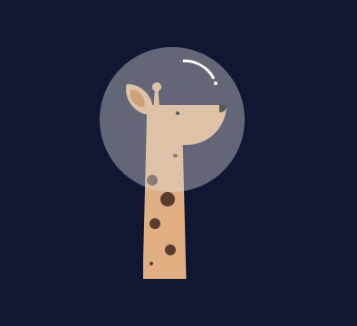

# Pure CSS Challenge: Astronaut Giraffe

*October 22, 2018* | Fell off my initial goal of doing one pure CSS image for all of May, but through work have gotten to practice and learn more about CSS. Decided to get back to practicing CSS and broadening my understanding further about postioning and classes through more pure CSS images. This first one is another animal cartoon (if you've seen the previous ones) but I hope to recreate more photographs in the future. 

## Other Pure CSS Images

* https://github.com/pennmeg/pure_css_desk-flatlay
* https://github.com/pennmeg/pure_css_pixel_heart
* https://github.com/pennmeg/pure_css_image
* https://github.com/pennmeg/pure_css_laptop
* https://github.com/pennmeg/pure_css_pug
* https://github.com/pennmeg/pure_css_tayles
* https://github.com/pennmeg/pure_css_cat
* https://github.com/pennmeg/pure_css_duck
* https://github.com/pennmeg/pure_css_ocanada
* https://github.com/pennmeg/pure_css_corgi
